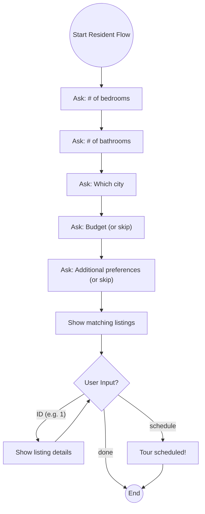
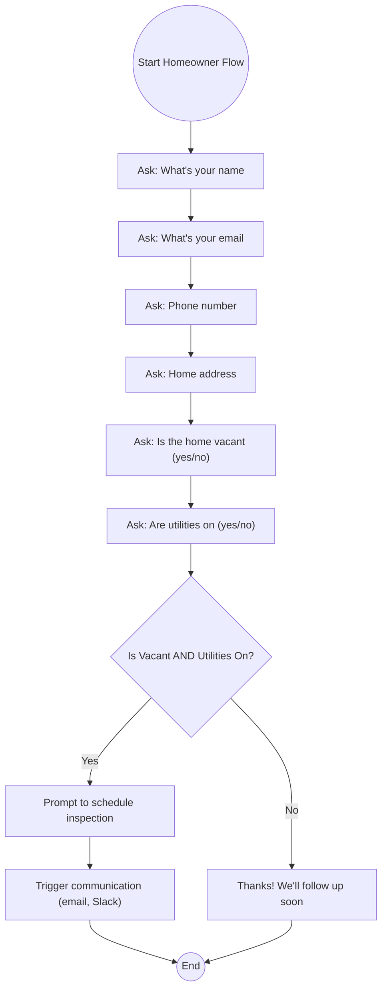

# Belong AI Agent

This repository demonstrates a **React + TypeScript** application that simulates an AI agent assisting two types of users:

1. **Homeowners**:  
   - Gathers contact/home details.  
   - If the home is vacant and utilities are on, schedules an inspection.  
   - Triggers a (simulated) communication (email/Slack) after scheduling.

2. **Residents**:  
   - Collects their preferences (bedrooms, bathrooms, city, budget, etc.).  
   - Displays a short list of matching homes.  
   - Offers more details and a way to schedule a tour (simulated).

A local **Open Source LLM** can also be integrated (e.g., GPT4All or Orca Mini) in the backend (FastAPI + ctransformers) for free-form conversation if desired. However, the main flows here are **step-based** conversation UIs in React.

---

## Table of Contents

1. [Architecture Overview](#architecture-overview)  
2. [Setup & Installation](#setup--installation)  
3. [Running the Application](#running-the-application)  
4. [Usage & Testing](#usage--testing)  
5. [Flows & Flowcharts](#flows--flowcharts)  
   - [Homeowner Conversation Flow](#homeowner-conversation-flow)  
   - [Resident Conversation Flow](#resident-conversation-flow)  
6. [Notes & Future Improvements](#notes--future-improvements)
7. [Advanced LLM Integration Notes](#advanced-llm-integration-notes)

---

## Architecture Overview

- **Frontend**: Built in **React + TypeScript** using a step-based chatbot pattern to guide users.  
- **Context**: A simple `AgentContext` that stores whether the user is a Homeowner or Resident.  
- **Homeowner Flow**: The **HomeownerAgent** component asks for name, contact info, vacancy, utilities; then schedules if vacant & utilities on.  
- **Resident Flow**: The **ResidentAgent** component gathers search criteria, shows mock listings, lets the user pick details or schedule.  
- **Optional LLM Integration**: If you have a **FastAPI** backend with GPT4All or ctransformers, you can embed advanced AI responses. Otherwise, the conversation logic is purely local (React state).

---

Key points:

- `HomeownerAgent.tsx` and `ResidentAgent.tsx` each handle a **chat-based** flow.
- `homeownerQuestions.ts` and `residentQuestions.ts` define the script of questions asked.

---

## Setup & Installation

1. **Clone** or download this repository.
2. **Install Node.js** (LTS recommended).
3. **Frontend** setup:
   ```bash
   cd bel-agent/frontend
   npm install
4. **Backend Setup**
   ```bash
   cd bel-agent/backend
   python -m venv venv
   source venv/bin/activate  # or .\venv\Scripts\activate on Windows
   pip install -r requirements.txt
   
---

## Running the Application

- **Frontend (React)**:
   ```bash
   cd bel-agent/frontend
   npm run dev
By default, Vite runs on http://localhost:5173.

- **Backend (FastAPI)**:
   ```bash
   cd bel-agent/backend
   uvicorn main:app --reload
Access the API docs at http://127.0.0.1:8000/docs.
In some cases, running backend without --reload is recommended,
depending on how heavy the LLM model using is.

---

## Usage & Testing

1. Open http://localhost:5173 in your browser (or the port you configured).
2. Select “Homeowner” or “Resident.”
3. If “Homeowner”:
   - AI prompts for name, email, phone, address, vacancy status, utility status.
   - If vacant & utilities on → user picks an inspection date/time.
   - Displays a message that it triggers an email/Slack (simulated).

4. If “Resident”:
   - AI prompts for bedrooms, bathrooms, city, budget, etc.
   - Shows a short list of mock properties matching that criteria.
   - User can type an ID for more details, “schedule” to set up a tour, or “done” to exit.

**Testing Notes**
   - Form vs. Chat: The example is fully chat-based. If you had a form-based approach, steps are similar but with standard HTML forms.
   - Go Back Button: Each agent has a “Go Back” button that resets the conversation and returns to the main user selection.
   - Mock Data: The Resident flow uses a small array of hardcoded listings. In production, you might call a real API or database.

---

## Flows & Flowcharts

### Homeowner Conversation Flow

**Explanation**
   1. The agent asks the homeowner each question in turn.
   2. After utilities and vacancy checks, we branch at Decision.
   3. If the home qualifies (Yes), we schedule an inspection and trigger communication.
   4. If “No,” we end with a simple follow-up message.


### Resident Conversation Flow

**Explanation**
   1. The agent collects user preferences (bedrooms, bathrooms, city, budget).
   2. It shows a filtered list of 2–3 matching homes.
   3. The user can type an ID to get more details, or type “schedule” to set up a tour, or “done” to exit.
   4. If “schedule,” we simulate a scheduled tour and then end the conversation.

---

## Notes & Future Improvements

   - Real API Integration: Instead of mock data, integrate an API or database for scheduling, property listings, or Slack/email triggers.
   - Validation: For phone/email, you might add more robust checks.
   - Natural Language Understanding: You could parse free-text answers using your local LLM or an external service. Right now, the conversation logic is straightforward (regex for yes/no, parseInt for numbers).
   - Styling: The UI is basic; you could enhance it with a design framework (Material UI, Bootstrap) or custom CSS.

---

## Advanced LLM Integration Notes

The current conversation flows are rule-based. To enable free-text interpretation, 
integrate a local or remote LLM in your backend. For example:
   1. Download a `.gguf` model for GPT4All or Orca Mini.
   2. Use the `ctransformers` library in `backend/main.py`.
   3. Parse user chat messages for entity extraction (bedrooms, bathrooms, etc.).

For more details, see [CTRANSFORMERS Readme](https://github.com/marella/ctransformers).